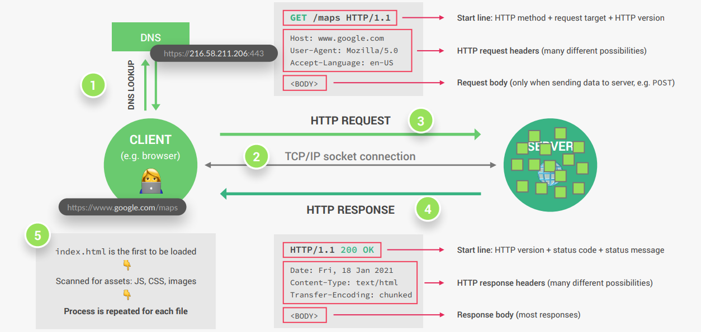

# cour5 :**Protocole HTTP:**

## 1. **Introduction:**

-   **Définition :**

    > Le **HTTP** (**HyperText Transfer Protocol**) est un protocole de communication utilisé sur le Web pour échanger des données entre un client (souvent un navigateur) et un serveur. Il est le fondement des échanges sur Internet, permettant de transférer des pages web, des images, des vidéos, et d'autres ressources.

-   **Principes de fonctionnement du HTTP:**

    -   **Modèle client-serveur** :

        -   Un client (ex. : navigateur web) envoie une requête au serveur.
        -   Le serveur répond avec une réponse, qui peut contenir les données demandées (comme une page web).

    -   **Sans état (stateless)** :

        -   Chaque requête HTTP est indépendante et ne conserve pas d'informations sur les requêtes précédentes.
        -   Pour gérer des sessions (ex. : connexion d'utilisateur), des mécanismes comme les cookies ou les tokens sont utilisés.

    -   **Basé sur des requêtes et des réponses** :
        -   Une **requête** HTTP contient des informations sur ce que le client veut (ex. : télécharger une page).
        -   Une **réponse** HTTP contient les données demandées ou des messages d’erreur.

## 2. **Requête && Réponse:**

-   **Structure d'une Requête HTTP:**

    1. **Ligne de requête** :

        - Contient :
            - Méthode HTTP (ex. : `GET`, `POST`, `PUT`, etc.).
            - URL de la ressource.
            - Version du protocole (ex. : `HTTP/1.1`).
        - Exemple :
            ```
            GET /index.html HTTP/1.1
            ```

    2. **En-têtes (Headers)** :

        - Fournissent des métadonnées sur la requête, comme le type de contenu accepté ou les informations d'authentification.
        - Exemple :
            ```
            Host: www.example.com
            User-Agent: Mozilla/5.0
            ```

    3. **Corps (Body)** (optionnel) :
        - Contient les données envoyées au serveur, souvent utilisé avec des méthodes comme `POST` ou `PUT`.
        - Exemple : données d'un formulaire soumis.

-   **Structure d'une Réponse HTTP:**

    1. **Ligne de statut** :

        - Contient :
            - Version du protocole (ex. : `HTTP/1.1`).
            - Code de statut (ex. : `200` pour OK, `404` pour non trouvé).
            - Message correspondant (ex. : "OK", "Not Found").
        - Exemple :
            ```
            HTTP/1.1 200 OK
            ```

    2. **En-têtes (Headers)** :

        - Informations sur la réponse (type de contenu, taille, cache, etc.).
        - Exemple :
            ```
            Content-Type: text/html
            Content-Length: 342
            ```

    3. **Corps (Body)** (optionnel) :
        - Contient les données réelles renvoyées au client (HTML, JSON, fichier, etc.).

## 3. **Méthodes HTTP:**

-   Les **méthodes HTTP** spécifient le type d'opération demandée par le client :

| **Méthode** | **Description**                                                  |
| ----------- | ---------------------------------------------------------------- |
| **GET**     | Récupérer une ressource (lecture).                               |
| **POST**    | Envoyer des données au serveur (ex. : formulaire).               |
| **PUT**     | Mettre à jour ou remplacer une ressource existante.              |
| **DELETE**  | Supprimer une ressource.                                         |
| **PATCH**   | Mettre à jour partiellement une ressource.                       |
| **HEAD**    | Récupérer les en-têtes d'une ressource sans le contenu.          |
| **OPTIONS** | Demander les méthodes et options disponibles pour une ressource. |

## 4. **Les Headers HTTP : Définition et Rôle**

-   Les **headers HTTP** sont des métadonnées ajoutées aux requêtes et réponses HTTP pour fournir des informations supplémentaires sur la transaction.

-   **Types de Headers:**

    1. **Headers généraux** : Applicables à toutes les requêtes ou réponses.

        - Exemple : `Cache-Control`, `Date`.

    2. **Headers spécifiques à la requête** : Fournissent des informations sur la demande du client.

        - Exemple :
            - `Host` : Nom de domaine cible.
            - `User-Agent` : Informations sur le client (navigateur, OS).

    3. **Headers spécifiques à la réponse** : Informations sur la réponse du serveur.

        - Exemple :
            - `Content-Type` : Type de contenu (ex. : `text/html`, `application/json`).
            - `Content-Length` : Taille du contenu.

    4. **Headers d'entité** : Données sur le contenu transféré.
        - Exemple :
            - `Content-Encoding` : Méthode de compression (ex. : `gzip`).
            - `ETag` : Identifiant unique pour une version de ressource.

-   **Exemple de transaction HTTP complète:**

    Requête HTTP

    ```
    GET /articles HTTP/1.1
    Host: www.example.com
    User-Agent: Mozilla/5.0
    Accept: text/html
    ```

    Réponse HTTP

    ```
    HTTP/1.1 200 OK
    Content-Type: text/html
    Content-Length: 1256

    <!DOCTYPE html>
    <html>
    <head>
        <title>Exemple</title>
    </head>
    <body>
        <h1>Bienvenue</h1>
    </body>
    </html>
    ```

### RQ : Évolution du HTTP

1. **HTTP/1.1** : Première version largement utilisée, prend en charge des connexions persistantes.
2. **HTTP/2** : Amélioration des performances grâce au multiplexage et à la compression des en-têtes.
3. **HTTP/3** : Basé sur le protocole QUIC, offre une meilleure rapidité et fiabilité en utilisant UDP au lieu de TCP.


