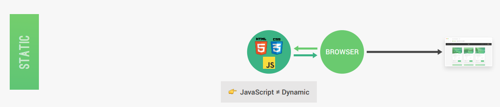
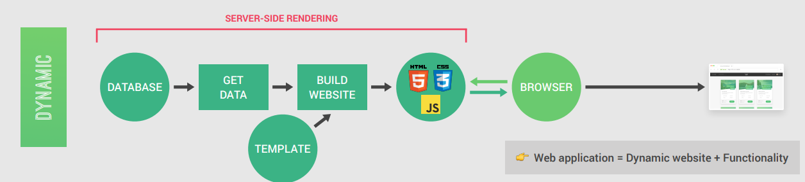
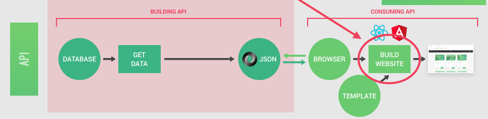
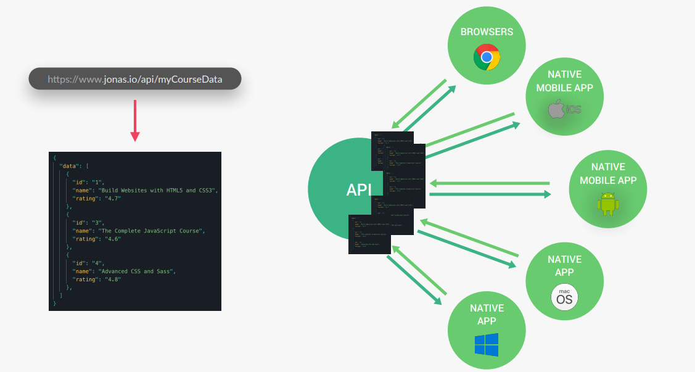

# cour 07 : **SSR vs CSR**

-   **Static Website :**

    -   Contenu pré-généré, livré tel quel au navigateur.
    -   Pas d'interaction avec une base de données ou un serveur pour générer le contenu.
    -   Exemple : Sites HTML/CSS simples.

-   **Dynamic Website:**

    -   Contenu généré en temps réel, souvent en fonction des interactions de l'utilisateur.
    -   Peut impliquer une base de données et un serveur pour construire les pages.

-   **Server-Side Rendering (SSR)**

    -   Le serveur génère entièrement la page HTML avant de l'envoyer au navigateur.
    -   Avantage : Bon pour le SEO, le contenu est immédiatement visible.
    -   Exemple : Frameworks comme Next.js (en mode SSR).

-   **Client-Side Rendering (CSR)**

    -   Le navigateur reçoit une page HTML minimaliste et génère le contenu dynamiquement via JavaScript.
    -   Avantage : Expérience utilisateur plus rapide après le chargement initial.
    -   Exemple : Frameworks comme React ou Angular (en mode SPA).

