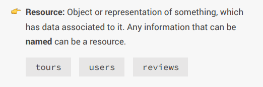
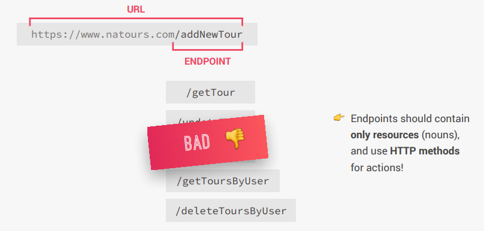
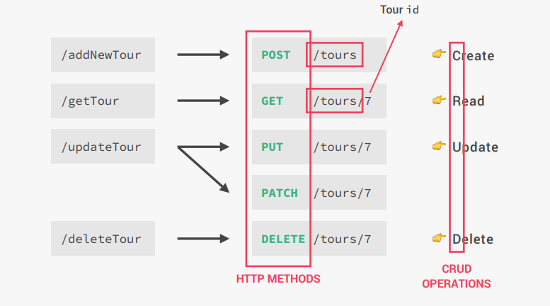
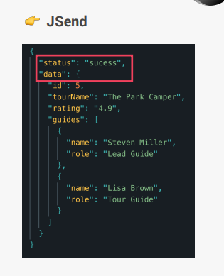
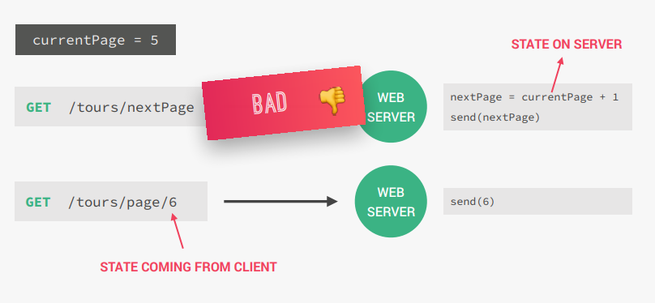

# cour 09 : **RESTFUL API**

## 1. **Introduction:**

-   **Définition :**

    > Une API RESTful (ou simplement API REST) est une interface de programmation d'application (API) qui suit les principes de l'architecture REST (Representational State Transfer).

-   **REST** est un style architectural pour la communication entre systèmes, conçu pour être léger, scalable et facile à comprendre. Les API RESTful permettent aux applications de communiquer via des requêtes HTTP standard (GET, POST, PUT, DELETE, etc.) tout en manipulant des ressources.

## 2. **THE REST ARCHITECTURE:**

-   **Séparer l'API en ressources logiques :**

    -   **Description :**

        > L'API doit être structurée autour de ressources logiques représentant des entités du système, comme des utilisateurs, des produits ou des commandes. Chaque ressource est une entité spécifique, identifiable et manipulable via des requêtes.

    -   **Exemple :**  
        Si vous gérez une boutique en ligne, les ressources pourraient inclure :
        -   **`/products`** : Liste des produits.
        -   **`/orders`** : Liste des commandes.
        -   **`/users`** : Liste des utilisateurs.

    

-   **Exposer des URLs structurées et basées sur des ressources**

    -   **Description :**

        > Les URLs doivent refléter la structure et la hiérarchie des ressources. Les endpoints doivent être clairs et significatifs, permettant aux développeurs de comprendre leur usage simplement en lisant l'URL.

    -   **Bonnes pratiques :**

        -   URLs doivent être basées sur des noms de ressources (noms au pluriel de préférence).
        -   Évitez les verbes dans les URLs (les méthodes HTTP servent déjà à spécifier l’action).

    -   **Exemple :**
        -   **GET** `/products` : Récupère tous les produits.
        -   **GET** `/products/123` : Récupère le produit avec l'ID 123.
        -   **POST** `/products` : Ajoute un nouveau produit.

    

-   **Utiliser les méthodes HTTP (verbes)**

    -   **Description :**

        > Les méthodes HTTP doivent être utilisées pour refléter les actions sur les ressources.

        -   **GET** : Lire une ressource.
        -   **POST** : Créer une nouvelle ressource.
        -   **PUT** : Mettre à jour une ressource existante.
        -   **DELETE** : Supprimer une ressource.

    -   **Exemple :**
        -   **GET** `/users` : Récupérer tous les utilisateurs.
        -   **POST** `/users` : Créer un nouvel utilisateur.
        -   **PUT** `/users/123` : Mettre à jour les informations de l'utilisateur ayant l'ID 123.
        -   **DELETE** `/users/123` : Supprimer l'utilisateur avec l'ID 123.

    

-   **Envoyer les données sous forme JSON (le plus souvent)**

    -   **Description :**

        > Les API RESTful échangent généralement des données au format JSON, car il est léger, facile à lire pour les humains et pris en charge nativement par les navigateurs et bibliothèques.

    -   **Exemple d'une réponse JSON :**  
         Une requête GET sur `/users/123` pourrait renvoyer :

        ```json
        {
            "id": 123,
            "name": "John Doe",
            "email": "john.doe@example.com",
            "role": "admin"
        }
        ```

    

-   **stateless:**

    -   **Description :**

        > Une API RESTful est **sans état**, ce qui signifie que chaque requête envoyée par le client contient toutes les informations nécessaires pour être traitée. Le serveur ne stocke pas d'état ou de session entre les requêtes.

        -   Par exemple, l'authentification est souvent réalisée via un **token** ou une clé API envoyée avec chaque requête (par ex., dans les en-têtes HTTP).

    -   **Exemple :**  
        Une requête GET pour récupérer un produit pourrait inclure un token dans les en-têtes :

        ```http
        GET /products/123 HTTP/1.1
        Host: api.example.com
        Authorization: Bearer YOUR_ACCESS_TOKEN
        ```

        -   Le serveur utilise le token pour authentifier l'utilisateur et traiter la requête. Si la session expire, le client devra fournir un nouveau token.

    

### **Résumé**

| Principe                           | Description                                    | Exemple                                      |
| ---------------------------------- | ---------------------------------------------- | -------------------------------------------- |
| **Séparer en ressources logiques** | Structurer autour d'entités du système         | `/products`, `/users`, `/orders`             |
| **URLs structurées et lisibles**   | Identifier les ressources via des URLs claires | `/products/123` pour un produit spécifique   |
| **Méthodes HTTP appropriées**      | Utiliser GET, POST, PUT, DELETE                | `GET /users`, `POST /users`                  |
| **Données au format JSON**         | Retourner des réponses en JSON                 | `{ "id": 1, "name": "Product A" }`           |
| **Stateless**                      | Aucune session sur le serveur                  | Token d'authentification dans chaque requête |
