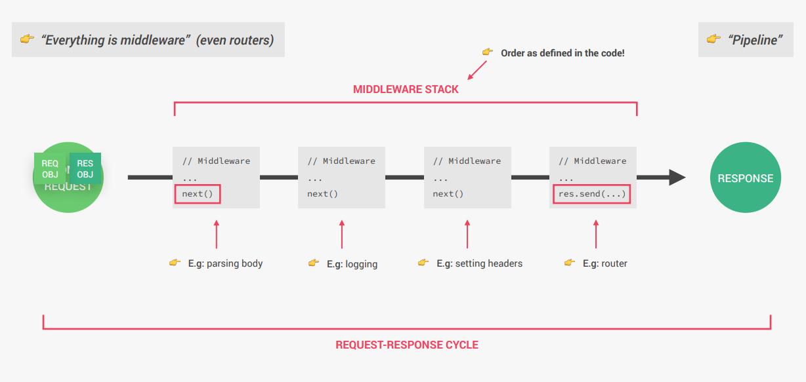

# cour 01 : **Introduction**

## 1. **Introduction:**

-   **Définition:**

    > Un **middleware** dans Express (ou en développement web en général) est une fonction qui intercepte les requêtes HTTP entrantes ou les réponses sortantes, les traite, puis les transmet à une autre fonction. Il agit comme une couche intermédiaire dans le cycle de traitement des requêtes-réponses.

    -   Les middlewares sont utilisés pour ajouter des fonctionnalités à votre application, comme l'authentification, la gestion des logs, ou l'analyse des données des requêtes.

    -   **Chaînage des middlewares :** Les middlewares sont exécutés dans l'ordre dans lequel ils sont déclarés. Ils peuvent modifier les objets `req` et `res` avant que la requête atteigne le gestionnaire final.

-   **Syntaxe:**

    Un middleware est une fonction qui prend trois arguments :

    ```javascript
    function middleware(req, res, next) {
        // Traitement ici
        next(); // Passe à l'étape suivante
    }
    ```

    -   **`req`** : L'objet de la requête HTTP.
    -   **`res`** : L'objet de la réponse HTTP.
    -   **`next`** : Une fonction qui appelle le prochain middleware dans la chaîne.

-   **Types de middlewares :**

    -   **Middlewares intégrés :** Fournis directement par Express pour des fonctionnalités courantes.

        -   **`express.json()`** : Analyse les données JSON dans les requêtes.
        -   **`express.static()`** : Servir des fichiers statiques (images, CSS, JS).

    -   **Middlewares tiers :** Des bibliothèques créées par la communauté pour des fonctionnalités spécifiques.

        -   **`cors`** : Pour gérer les autorisations CORS.
        -   **`morgan`** : Pour les logs HTTP.

    -   **Middlewares définis par l'utilisateur :** Vous pouvez créer vos propres middlewares pour des tâches spécifiques comme la vérification d'authentification ou la gestion des erreurs.



## 2. **Défintion en express js : `app.use((req, res, next))`**

-   **Définition**

    -   Un middleware est une fonction qui intercepte la requête et peut effectuer des opérations avant de passer le contrôle à la prochaine fonction (via `next()`).

    -   Il peut être appliqué à :

        -   Toutes les routes (**global**).
        -   Une ou plusieurs routes spécifiques.

    -   Le middleware peut :

        -   **Modifier** les objets `req` ou `res`.
        -   **Terminer** le cycle Request-Response.
        -   **Appeler** `next()` pour passer au middleware suivant.

-   **Syntaxe**

    ```javascript
    app.use((req, res, next) => {
        // Code du middleware
        next(); // Passer au middleware ou gestionnaire suivant
    });
    ```

    -   **`req`** : L'objet de requête, contenant les informations envoyées par le client.
    -   **`res`** : L'objet de réponse, utilisé pour envoyer des données au client.
    -   **`next`** : Une fonction qui transfère le contrôle au middleware suivant.

-   **Exemple 1 : Middleware global**

    ```javascript
    const express = require("express");
    const app = express();

    // Middleware global
    app.use((req, res, next) => {
        console.log(`Requête reçue : ${req.method} ${req.url}`);
        next(); // Passer au middleware suivant
    });

    // Route principale
    app.get("/", (req, res) => {
        res.send("Bienvenue sur la page d'accueil");
    });

    const port = 3000;
    app.listen(port, () => {
        console.log(`Serveur démarré sur http://localhost:${port}`);
    });
    ```

-   **Exemple 2 : Middleware pour une route spécifique**

    ```javascript
    app.use("/api", (req, res, next) => {
        console.log("Middleware exécuté pour les routes /api");
        next();
    });

    app.get("/api/data", (req, res) => {
        res.send("Voici vos données");
    });

    app.get("/other", (req, res) => {
        res.send("Cette route ne passe pas par le middleware");
    });
    ```

### RQ : **Ordre des middlewares**

Les middlewares sont exécutés dans l’ordre où ils sont définis.

```javascript
app.use((req, res, next) => {
    console.log("Middleware 1");
    next();
});

app.use((req, res, next) => {
    console.log("Middleware 2");
    next();
});

app.get("/", (req, res) => {
    res.send("Route finale");
});
```
