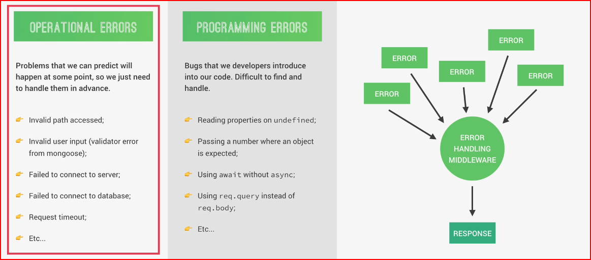

# cour : **Overveiw**

- La gestion des erreurs en **Express.js** est une partie essentielle du développement backend. Elle permet d'assurer que l'application répond de manière **claire et sécurisée** aux erreurs, qu'elles soient **systémiques**, **logiques**, ou liées à **l'utilisateur** . 

- **Types d'erreurs en Express.js** Les erreurs peuvent être classées en plusieurs catégories :
    
    - **Erreurs de routes inconnues** → Accès à une route inexistante (`404 Not Found`).
    
    - **Erreurs d'application** → Problèmes internes (`500 Internal Server Error`).
    
    - **Erreurs utilisateur** → Mauvaise requête (`400 Bad Request`).
    
    - **Erreurs liées aux bases de données** → Problèmes de connexion ou validation (`MongoDB`, `PostgreSQL`, etc.).
    
    - **Erreurs d'authentification et d'autorisation** → Accès non autorisé (`401 Unauthorized`, `403 Forbidden`).

