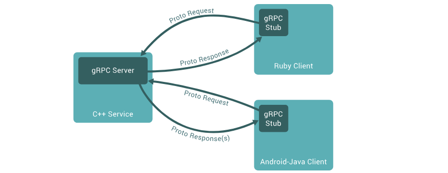

# cour 01 : **gRPC**

-   **Définition de gRPC**

    > **gRPC** (gRPC Remote Procedure Call) est un framework open-source, développé initialement par Google, permettant la communication entre services distribués dans un système. Il repose sur le protocole HTTP/2 pour le transport, Protobuf (Protocol Buffers) comme langage de sérialisation des données, et offre une communication rapide, efficace et interopérable entre systèmes.

    -   In gRPC, a client application can directly call a method on a server application on a different machine as if it were a local object, making it easier for you to create distributed applications and services. As in many RPC systems, gRPC is based around the idea of defining a service, specifying the methods that can be called remotely with their parameters and return types. On the server side, the server implements this interface and runs a gRPC server to handle client calls. On the client side, the client has a stub (referred to as just a client in some languages) that provides the same methods as the server.

    

-   **Caractéristiques principales de gRPC :**

    -   **Basé sur HTTP/2 :**

        -   Offre une meilleure gestion des performances grâce à la compression des en-têtes.

    -   **Protobuf pour la sérialisation :**

        -   Protobuf (Protocol Buffers) est un langage compact, binaire et efficace pour sérialiser les messages.

    -   **Modèle d'appel flexible :**
        gRPC supporte différents types de communication :

        -   **Unary** : Un client envoie une requête et reçoit une réponse.
        -   **Server Streaming** : Le client envoie une requête et reçoit un flux de réponses du serveur.
        -   **Client Streaming** : Le client envoie un flux de requêtes et reçoit une réponse unique.
        -   **Bidirectional Streaming** : Les deux parties échangent des flux de données de manière simultanée.

    -   **Indépendance des langages :**

        -   gRPC supporte de nombreux langages (C++, Python, Java, Go, Node.js, etc.), facilitant l'interopérabilité entre services écrits dans différents langages.

    -   **Interopérabilité :**
        -   gRPC garantit que les services peuvent communiquer sans nécessiter de modifications majeures dans les différentes implémentations.

-   **Fonctionnement de base**

    -   Définir les messages et services dans un fichier `.proto` :

        ```proto
        syntax = "proto3";

        service Greeter {
        rpc SayHello (HelloRequest) returns (HelloReply);
        }

        message HelloRequest {
        string name = 1;
        }

        message HelloReply {
        string message = 1;
        }
        ```

    -   Générer des stubs pour les langages cibles à l'aide des outils gRPC.

    -   Implémenter les méthodes du service côté serveur.

    -   Consommer le service avec un client gRPC.
