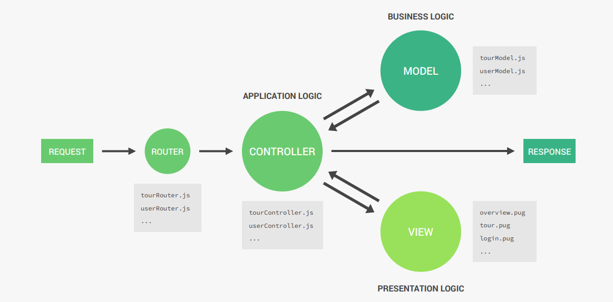

# cour 18 : **MVC**

## 1. **Introduction:**

-   **Définition:**

    > **MVC** (Model-View-Controller) est un modèle d'architecture logicielle utilisé pour organiser les applications en trois couches distinctes :

    -   **Model** : Gère les données et la logique métier de l'application. Il interagit avec la base de données et encapsule les règles métier.
    -   **View** : Responsable de l'affichage des données à l'utilisateur. Dans le backend, cela peut inclure des fichiers HTML ou des templates rendus dynamiquement.
    -   **Controller** : Sert d'intermédiaire entre le Model et la View. Il traite les requêtes utilisateur, interagit avec le Model, et retourne la réponse appropriée via la View.

-   **Utilisation de l'architecture MVC dans Express.js**

    -   **Model** : Représentation des données, généralement avec une ORM/ODM comme Mongoose ou Sequelize.

    -   **Controller** : Contient la logique pour gérer les requêtes et réponses (ex. : récupérer des données, appeler un service, etc.).

    -   **View** : Fournit des pages HTML rendues dynamiquement (ex. : avec un moteur de template comme EJS, Pug, ou Handlebars).

-   **Structure :**

```
project/
├── models/         # Contient les modèles (schémas de données)
│   └── userModel.js
├── controllers/    # Contient les contrôleurs (logique de traitement)
│   └── userController.js
├── views/          # Contient les vues (fichiers HTML ou templates)
│   └── index.ejs
├── routes/         # Définit les routes de l'application
│   └── userRoutes.js
├── app.js          # Point d'entrée principal
└── package.json    # Fichier de configuration du projet
```



## 2. **Exemple détaillé :**

-   **Model:**

    Définit la structure des données avec Mongoose :

    ```javascript
    const mongoose = require("mongoose");

    const userSchema = new mongoose.Schema({
        username: { type: String, required: true, unique: true },
        email: { type: String, required: true, unique: true },
        password: { type: String, required: true },
    });

    module.exports = mongoose.model("User", userSchema);
    ```

-   **Controlleur:**

    ```javascript
    const User = require("../models/User");

    exports.getAllUsers = async (req, res) => {
        try {
            const users = await User.find();
            res.render("users", { users }); // Passer les données à la vue
        } catch (error) {
            res.status(500).send("Erreur serveur");
        }
    };

    exports.createUser = async (req, res) => {
        try {
            const { username, email, password } = req.body;
            const newUser = new User({ username, email, password });
            await newUser.save();
            res.redirect("/users"); // Redirige après création
        } catch (error) {
            res.status(500).send("Erreur lors de la création de l'utilisateur");
        }
    };
    ```

-   **View: `EJS`**

    Affiche les données à l’utilisateur :

    ```html
    <!DOCTYPE html>
    <html lang="en">
        <head>
            <meta charset="UTF-8" />
            <meta
                name="viewport"
                content="width=device-width, initial-scale=1.0"
            />
            <title>Users</title>
        </head>
        <body>
            <h1>Liste des utilisateurs</h1>
            <ul>
                <% users.forEach(user => { %>
                <li><%= user.username %> - <%= user.email %></li>
                <% }); %>
            </ul>
        </body>
    </html>
    ```

-   **Route:**

    ```javascript
    const express = require("express");
    const router = express.Router();
    const userController = require("../controllers/userController");

    router.get("/users", userController.getAllUsers); // Liste des utilisateurs
    router.post("/users", userController.createUser); // Crée un utilisateur

    module.exports = router;
    ```

-   **`app.js`:**

    ```javascript
    const express = require("express");
    const mongoose = require("mongoose");
    const userRoutes = require("./routes/userRoutes");
    const path = require("path");

    const app = express();

    // Configuration de Mongoose
    mongoose.connect("mongodb://localhost:27017/mvc_app");

    // Configuration d'Express
    app.set("view engine", "ejs"); // Moteur de template
    app.set("views", path.join(__dirname, "views"));
    app.use(express.urlencoded({ extended: true })); // Parse les données des formulaires

    // Routes
    app.use("/", userRoutes);

    // Démarrage du serveur
    app.listen(3000, () => {
        console.log("Serveur démarré sur http://localhost:3000");
    });
    ```
