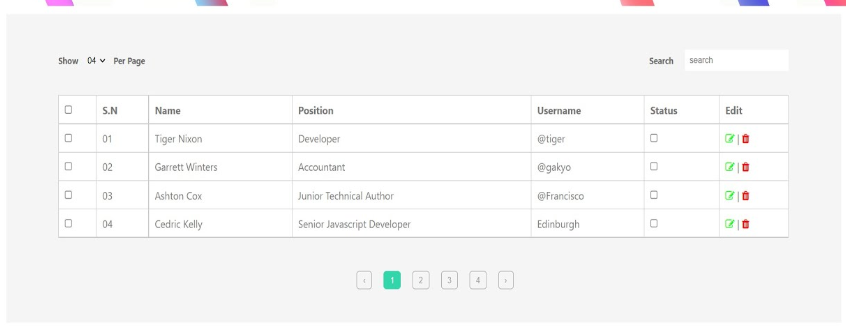

# cour 22 : **Pagination:**

## 1. **Pagination :**


- **Définition :**

    > La pagination est une technique utilisée pour diviser un grand ensemble de données en petits blocs appelés pages. Elle permet de charger et afficher les données par sections, améliorant ainsi la performance et l'expérience utilisateur en évitant de surcharger le client avec trop d'informations en une seule fois.


- **Structure :** 

  - Une **page** représente un sous-ensemble de données (par exemple, 10 éléments par page).

  - Les paramètres courants pour la pagination sont :
    - `page` : Numéro de la page à récupérer.
    - `limit` : Nombre d'éléments à inclure par page.





## 2. **Pagination en REST API:**


- **Description :**

    - Les paramètres `page` et `limit` sont envoyés via l'URL sous forme de query parameters.
        - `page` : Spécifie la page souhaitée.
        - `limit` : Définit le nombre d’éléments à afficher par page.
    
    - Pour récupérer les données de la page `page`, on saute `(page - 1) * limit` éléments. Cela est géré avec la méthode **`skip()`** de Mongoose.
    - Ensuite, on limite le nombre d’éléments à `limit` avec la méthode **`limit()`**.


- **Syntaxe :**

   ```http
   GET /api/products?page=2&limit=10
   ```


## 3. **Les Méthodes `skip` et `limit` en Mongoose:**


- **Définition :**  

    > La méthode `skip(n)` est utilisée pour sauter les `n` premiers documents lors de l'exécution d'une requête.

    > La méthode `limit(n)` est utilisée pour limiter le nombre de documents retournés à `n`.

- **Syntaxe :**  
  ```javascript
  Model.find(query).skip(n);
  Model.find(query).limit(n);
  ```


- **Exemple:**


    ```http
    GET /api/products?page=2&limit=5
    ```

    ```javascript
    app.get('/api/products', async (req, res) => {
    try {
        const page = parseInt(req.query.page) || 1; // Par défaut, page = 1
        const limit = parseInt(req.query.limit) || 10; // Par défaut, limit = 10
        const skip = (page - 1) * limit;

        // Récupérer les produits avec pagination
        const products = await Product.find().skip(skip).limit(limit);

        if(req.query.page) {
            const nbTotale = await Product.countDocuments(); 
            if(skip >= nTotale) throw new Error("page does not exits");
        }

        res.status(200).json({
        status: 'success',
        page,
        limit,
        results: products.length,
        data: { products },
        });
    } catch (err) {
        res.status(400).json({ status: 'fail', message: err.message });
    }
    });
    ```


