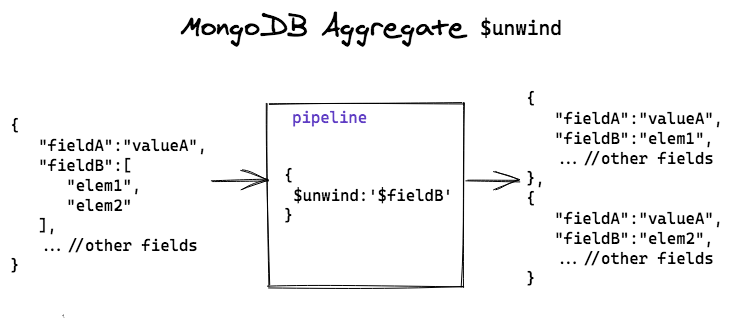

# cour 23 : **Aggregation pipeline**


## 1. **Introduction:**

- **Définition**

    > L'**aggregation pipeline** en MongoDB est un outil puissant pour traiter et analyser des données directement dans une base MongoDB. Elle est utilisée pour effectuer des transformations de données, des calculs agrégés et des analyses complexes sans avoir besoin d'extraire les données dans une autre application. 


    - L'**aggregation pipeline**  permet de réaliser des opérations complexes en enchaînant plusieurs étapes (**stages**) sur les documents d'une collection. Chaque étape transforme les données d'une manière spécifique et transmet le résultat à l'étape suivante.


- **Structure de la pipeline :**

   - Une pipeline est une séquence d'étapes définies sous forme de tableaux.
   - Chaque étape est un objet JSON qui spécifie une opération.
   - Les étapes sont exécutées dans l'ordre où elles sont définies.
   - La pipeline traite les documents par flux (**stream processing**) : chaque document traverse toutes les étapes.


-  **Les étapes courantes :**

   - **`$match`** : Filtre les documents (similaire à un filtre `WHERE` en SQL).
   - **`$group`** : Agrège les documents en fonction d'un ou plusieurs champs.
   - **`$project`** : Restructure ou sélectionne les champs pour chaque document.
   - **`$sort`** : Trie les documents par un ou plusieurs champs.
   - **`$limit`** : Limite le nombre de documents renvoyés.
   - **`$skip`** : Ignore un nombre spécifique de documents.
   - **`$unwind`** : Décompose des tableaux en documents individuels.
   - **`$lookup`** : Effectue une jointure avec une autre collection.
   - **`$addFields`** : Ajoute de nouveaux champs ou modifie les champs existants.


- **Exemple d'aggregation pipeline :**

    Supposons que nous ayons une collection `orders` contenant des commandes, et que nous souhaitons connaître le total des ventes par produit.

    ```json
    db.orders.aggregate([
    { "$match": { "status": "completed" } }, // Étape 1 : Filtrer les commandes terminées
    { "$group": { "_id": "$product", "totalSales": { "$sum": "$amount" } } }, // Étape 2 : Grouper par produit
    { "$sort": { "totalSales": -1 } } // Étape 3 : Trier par ventes décroissantes
    ])
    ```

## 2. **La fonction `aggregate` dans Mongoose**


- **Définition :**

    - La méthode `ModelName.aggregate()` est utilisée pour exécuter une pipeline d'agrégation sur les documents d'une collection associée à un modèle Mongoose.
    - Elle retourne une **liste d'objets** contenant les résultats de chaque groupe ou transformation définie dans la pipeline.


- **Syntaxe :**

    ```javascript
    ModelName.aggregate([
    { $stage1: { key: value } }, // Étape 1
    { $stage2: { key: value } }, // Étape 2
    ...
    ], callback);
    ```

    - **`$stage`** : Un opérateur d'agrégation MongoDB, comme `$match`, `$group`, `$sort`, etc.
    - **`key` / `value`** : Les conditions ou transformations appliquées dans chaque étape.
    - **Callback (optionnel)** : Une fonction pour gérer le résultat ou les erreurs.


- **Exemple :**

    Calculer le total des ventes (`totalSales`) pour chaque produit (`productName`) dans une collection `orders`.

    ```javascript
    Order.aggregate([
    { $match: { status: "completed" } },  
    { 
        $group: { 
        _id: "$productName", // Groupement par le champ productName
        totalSales: { $sum: { $multiply: ["$quantity", "$price"] } }, // Somme du prix total par produit
        totalQuantity: { $sum: "$quantity" } // Total des quantités vendues
        }
    },
    { $sort: { totalSales: -1 } },
    { $limit: 5 }
    ])
    .then(result => {
    console.log(result);
    })
    .catch(err => {
    console.error(err);
    });
    ```


## 3. **``Stages:``**


- **Match** :

    - L'étape `$match` permet de filtrer les documents dans une collection en fonction d'une condition spécifiée. Elle est équivalente à une requête de type `find`.


    - **Syntaxe:**

        ```json
        {
        $match: {
            <field>: <value>,
            <field2>: { <operator>: <value> }
        }
        }
        ```

    - **Exemple :**

        Filtrer les documents où l'âge est supérieur à 25.
        ```javascript
        db.collection.aggregate([
        { $match: { age: { $gt: 25 } } }
        ])
        ```

- **Group :**


    - L'étape `$group` regroupe les documents par un champ spécifié et applique des opérations d'agrégation comme la somme, la moyenne, etc.

    - **Syntaxe :**

        ```json
        {
        $group: {
            _id: <expression>, 
            <field1>: { <accumulator>: <expression> },
            <field2>: { <accumulator>: <expression> }
        }
        }
        ```
        - ``accumulator`` : `$sum` , `$avg` , `$max` et `$min`
        - ``expression`` : `'$FieldName'`


    - **Exemple :**

        Calculer l'âge moyen des utilisateurs par groupe de ville.
        ```javascript
        db.collection.aggregate([
        {
            $group: {
            _id: "$city",
            averageAge: { $avg: "$age" }
            }
        }
        ])
        ```


- **Sort :**


    - L'étape `$sort` permet de trier les documents par un ou plusieurs champs dans l'ordre croissant (`1`) ou décroissant (`-1`).


    - **Syntaxe :**

        ```json
        {
        $sort: {
            <field1>: <order>,
            <field2>: <order>
        }
        }
        ```

        - `order` : ``1`` (croissant) , ``- 1`` (décroissant)


    - **Exemple :**

        Trier les utilisateurs par âge décroissant.
        ```javascript
        db.collection.aggregate([
        { $sort: { age: -1 } }
        ])
        ```


- **Unwind :**

  - L'étape `$unwind` décompose un tableau en créant un document distinct pour chaque élément du tableau.
  - Elle est utile pour travailler avec des champs de type tableau dans une pipeline d'agrégation.

    - **Syntaxe :**
        ```json
        {
            $unwind: "$fieldName"
        }
        ```

    - **Exemple :**
        Décomposer le tableau `skills` pour chaque utilisateur.
        ```javascript
        db.collection.aggregate([
            { $unwind: "$skills" }
        ])
        ```

    


- **Project :**

  - L'étape `$project` permet de sélectionner ou de transformer les champs des documents en spécifiant quels champs inclure, exclure ou modifier.

    - **Syntaxe :**
        ```json
        {
            $project: {
            <field1>: <include|exclude>,
            <field2>: <expression>
            }
        }
        ```

        - `1` : Inclure un champ.
        - `0` : Exclure un champ.
        - `<expression>` : Transforme ou crée un nouveau champ.

    - **Exemple :**
        Inclure les champs `name` et `age`, mais exclure `_id`.
        ```javascript
        db.collection.aggregate([
            {
            $project: {
                _id: 0,
                name: 1,
                age: 1
            }
            }
        ])
        ```


- **Limit :**

  - L'étape `$limit` est utilisée pour limiter le nombre de documents dans le résultat.
  - Elle est utile pour la pagination ou les extractions partielles.

    - **Syntaxe :**
        ```json
        {
            $limit: <number>
        }
        ```

        - `<number>` : Nombre maximum de documents à inclure dans le résultat.

    - **Exemple :**
        Limiter le résultat à 5 documents.
        ```javascript
        db.collection.aggregate([
            { $limit: 5 }
        ])
        ```


- **AddFields :**

  - L'étape `$addFields` est utilisée pour ajouter de nouveaux champs ou modifier des champs existants dans les documents. Les nouveaux champs peuvent être basés sur des expressions ou des transformations de champs existants.

    - **Syntaxe :**  
        ```json
        {
            $addFields: {
            <newField1>: <expression>,
            <newField2>: <expression>
            }
        }
        ```

        - `<newField>` : Nom du champ à ajouter ou à modifier.
        - `<expression>` : Expression ou valeur qui sera affectée au champ.

        

    - **Exemple :**


        ```json
        [
        { "_id": 1, "name": "Alice", "salary": 3000, "bonus": 500 },
        { "_id": 2, "name": "Bob", "salary": 4000, "bonus": 700 },
        { "_id": 3, "name": "Charlie", "salary": 3500, "bonus": 600 }
        ]
        ```

        ```javascript
        db.employees.aggregate([
        {
            $addFields: {
            totalCompensation: { $add: ["$salary", "$bonus"] }
            }
        }
        ])
        ```


