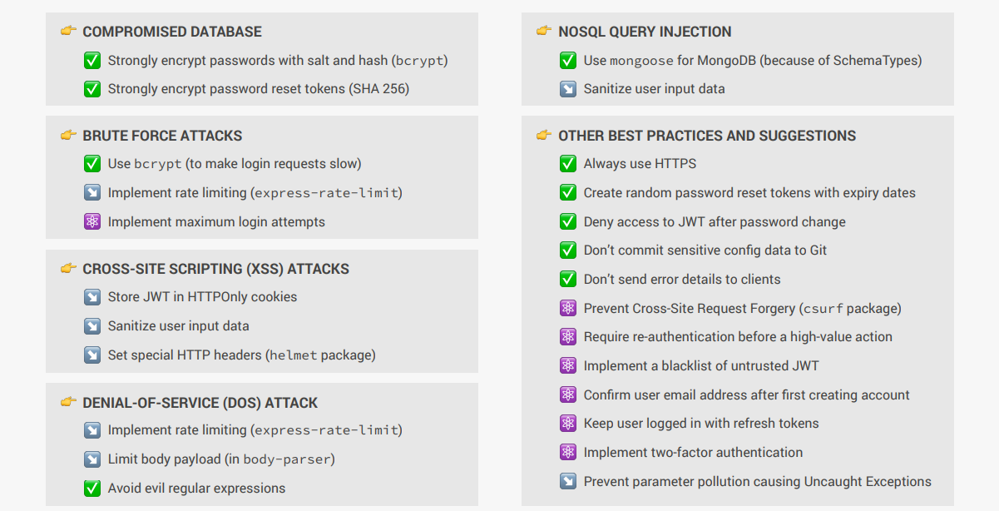

L’**authentification** est le processus qui permet de vérifier l’identité d’un utilisateur avant de lui accorder l’accès à un service. Il existe plusieurs types d’authentification, selon le niveau de sécurité requis et le contexte d’utilisation.  

---

### **📌 1. Authentification par Identifiants (Username & Password)**
✅ **Principe :** L'utilisateur entre son **email/nom d'utilisateur** et un **mot de passe** pour s'authentifier.  
✅ **Exemple :** Ce que tu as implémenté avec JWT (`login` avec email + password).  
❌ **Limites :** Vulnérable aux attaques de type **brute-force** et **phishing** si les mots de passe sont faibles.  

---

### **📌 2. Authentification Basée sur un Token (JWT, OAuth)**
✅ **Principe :** Une fois l’utilisateur authentifié, un **token** (ex: JWT) lui est délivré. Il doit l’envoyer à chaque requête pour prouver son identité.  
✅ **Exemple :** API REST avec **JWT** (`jsonwebtoken.sign()` et `jsonwebtoken.verify()`).  
✅ **Avantages :** **Stateless** (pas besoin de stocker des sessions sur le serveur).  
❌ **Limites :** Si le token est volé, il peut être utilisé jusqu’à expiration (**solution : refresh tokens, cookies sécurisés**).  

---

### **📌 3. Authentification Multi-Facteurs (MFA / 2FA)**
✅ **Principe :** L’utilisateur doit fournir **deux ou plusieurs preuves d’identité**.  
- **1er facteur :** Mot de passe  
- **2e facteur :** Un code envoyé par SMS, une app (Google Authenticator), un scan biométrique…  
✅ **Avantages :** **Sécurité renforcée**, car même si un mot de passe est volé, l’attaquant a besoin d’un deuxième élément.  
❌ **Limites :** Peut être contraignant pour l’utilisateur.  

---

### **📌 4. Authentification avec OAuth 2.0 (Google, Facebook, GitHub…)**
✅ **Principe :** L’utilisateur s’authentifie via **un service tiers (Google, Facebook, GitHub)**, qui fournit ensuite un token d’accès à ton application.  
✅ **Exemple :** Authentification avec **Google OAuth** (via `passport.js`).  
✅ **Avantages :** L’utilisateur n’a pas besoin de créer un compte et de gérer un mot de passe.  
❌ **Limites :** Dépendance à un **service tiers** (Google, Facebook…).  

---

### **📌 5. Authentification Biométrique**
✅ **Principe :** Basée sur des caractéristiques uniques comme **l’empreinte digitale, la reconnaissance faciale, la rétine**…  
✅ **Exemple :** **Face ID sur iPhone**, empreinte digitale sur Android.  
✅ **Avantages :** **Sécurité forte et rapide** (pas besoin de se souvenir d’un mot de passe).  
❌ **Limites :** Peut être contourné par des attaques avancées, et pose des **problèmes de confidentialité**.  

---

### **📌 6. Authentification Basée sur les Clés API**
✅ **Principe :** Un client (ex: une application, un service externe) utilise une **clé API** pour s’authentifier auprès d’une API.  
✅ **Exemple :** Authentification avec une **clé API dans les headers** (`Authorization: Bearer <API_KEY>`).  
✅ **Avantages :** **Simple et efficace** pour les intégrations machine-to-machine.  
❌ **Limites :** Si la clé est exposée, elle peut être **utilisée par n’importe qui**.  

---

### **📌 7. Authentification par Certificat (SSL/TLS)**
✅ **Principe :** L’authentification repose sur un **certificat numérique** stocké sur l’appareil ou le navigateur.  
✅ **Exemple :** Authentification dans les entreprises avec **certificats X.509**.  
✅ **Avantages :** Très sécurisé et difficile à falsifier.  
❌ **Limites :** Difficile à mettre en place pour le grand public.  

---

### **🧐 Conclusion : Quel type d’authentification choisir ?**
- **Application web classique ?** ➝ **JWT ou Sessions avec Express.js**  
- **Application mobile ?** ➝ **OAuth (Google, Facebook)** ou **JWT avec stockage sécurisé**  
- **Application bancaire ?** ➝ **MFA/2FA obligatoire** (code SMS ou biométrie)  
- **API publique ?** ➝ **Clés API + OAuth**  
- **Entreprise (VPN, accès interne) ?** ➝ **Certificats SSL/TLS**  

📌 **Ce que tu as implémenté (JWT) est une bonne solution pour une API REST.** Mais si tu veux aller plus loin, tu peux **ajouter un refresh token** et/ou **utiliser OAuth** pour une meilleure gestion des accès. 🚀