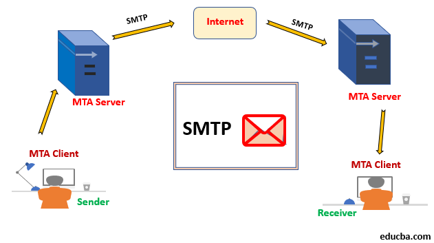

# Cour 29 : 📩 **Cours sur Nodemailer et la Gestion des Emails**  


- L’envoi d’e-mails est un élément clé dans les applications web modernes, notamment pour la validation des comptes, les notifications et les alertes. Dans ce cours, nous allons explorer :  

    - **Les bases du fonctionnement des emails** (SMTP, client-serveur, etc.)  

    - **Le package Nodemailer** et son utilisation  
    
    - **Mailtrap** et son rôle dans les tests d’emails  


## 1. **Gestion des Emails et Fonctionnement Réseau**  


### 1.1. **Comment fonctionne l’envoi d’un email ? :**  

- L’envoi d’un email suit un **modèle client-serveur** basé sur le protocole **SMTP (Simple Mail Transfer Protocol)**. Voici les étapes principales :  

1️⃣ **Le client (expéditeur)** crée un email (sujet, contenu, destinataire).  
2️⃣ **Le serveur SMTP de l’expéditeur** reçoit l’email et l’analyse.  
3️⃣ **Le serveur SMTP contacte le serveur du destinataire** via DNS pour connaître son serveur de messagerie (MX - Mail Exchange).  
4️⃣ **Le serveur SMTP du destinataire** stocke l’email dans une boîte de réception.  
5️⃣ **Le destinataire récupère l’email** avec **POP3** ou **IMAP** via un client (Gmail, Outlook, etc.).  





### 1.2.**Protocoles utilisés dans la gestion des emails**  

📌 **SMTP (Simple Mail Transfer Protocol)**  

- 📤 Utilisé pour envoyer des emails.  
- Nécessite une authentification (email + mot de passe).  
- Exemples : Gmail, Outlook, Mailtrap.  

📌 **POP3 (Post Office Protocol v3)**  

- 📥 Permet au client de récupérer ses emails depuis un serveur.  
- Supprime généralement les emails du serveur après récupération.  

📌 **IMAP (Internet Message Access Protocol)**  

- 📥 Comme POP3, mais **les emails restent sur le serveur** (synchronisation sur plusieurs appareils).  
- Exemples : Gmail IMAP, Yahoo IMAP.  


##  2.**Nodemailer : La solution pour envoyer des emails avec Node.js**  

- **Qu'est-ce que Nodemailer ?**  

    > **Nodemailer** est un **package Node.js** permettant d’envoyer des emails **facilement via SMTP**. Il prend en charge les services email populaires (**Gmail, Outlook, Yahoo**) et permet aussi l’envoi via des **serveurs SMTP personnalisés**.  


- **Installation:**

    ```sh
    npm install nodemailer
    ```


- **Configuration et Envoi d’un Email avec Gmail:**  

    Voici un exemple de code pour envoyer un email via **Gmail SMTP** :  

    ```javascript
    const nodemailer = require("nodemailer");

    // Configuration du transporteur SMTP
    const transporter = nodemailer.createTransport({
        service: "gmail",
        auth: {
            user: "ton-email@gmail.com",
            pass: "ton-mot-de-passe-app" // Utilise un mot de passe d'application pour Gmail
        }
    });

    // Options de l'email
    const mailOptions = {
        from: "ton-email@gmail.com",
        to: "destinataire@example.com",
        subject: "Test Nodemailer",
        text: "Ceci est un test d'envoi d'email avec Nodemailer !",
        <!-- html: `<h1>Bonjour !</h1><p>Ceci est un email HTML avec <b>Nodemailer</b> 🚀</p>`, -->
        attachments: [
            {
                filename: "test.txt",
                path: "./test.txt",
            },
            
        ],
    };

    // Envoi de l'email
    transporter.sendMail(mailOptions, (error, info) => {
        if (error) {
            console.log("Erreur lors de l'envoi :", error);
        } else {
            console.log("Email envoyé avec succès :", info.response);
        }
    });
    ```


##  3. **Mailtrap :**  

- **Qu'est-ce que Mailtrap ?**

    Mailtrap est un **simulateur de serveur SMTP** utilisé pour tester l’envoi d’emails **sans envoyer de vrais emails**.  
    ✅ Permet de voir les emails envoyés sans toucher aux vraies boîtes de réception.  
    ✅ Utile en **développement** pour tester les emails avant de passer en production.  
    ✅ Empêche l’envoi d’emails accidentels à des utilisateurs réels.  

- Mailtrap remplace un vrai serveur SMTP et évite d’envoyer des emails en production accidentellement.  

- **Comment configurer Nodemailer avec Mailtrap ?**  

    1️⃣ **Créer un compte sur [Mailtrap](https://mailtrap.io/)**  
    2️⃣ **Récupérer les identifiants SMTP** dans l'onglet "Inbox -> SMTP Settings"  
    3️⃣ **Configurer Nodemailer avec ces identifiants**  

-  **Configuration de Mailtrap dans Nodemailer:**

    ```javascript
    const transporter = nodemailer.createTransport({
        host: "smtp.mailtrap.io",
        port: 2525,
        auth: {
            user: "ton-user-mailtrap",
            pass: "ton-pass-mailtrap"
        }
    });


    ```

