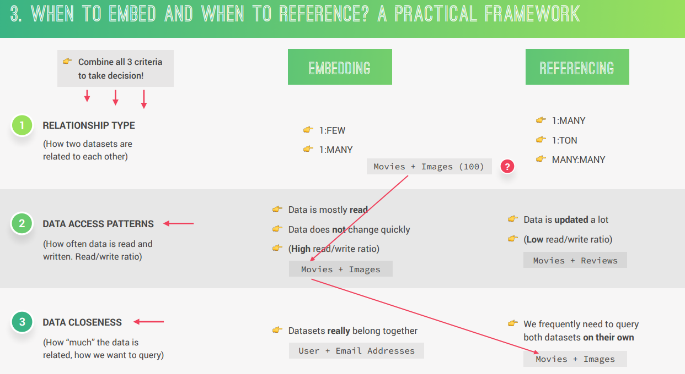
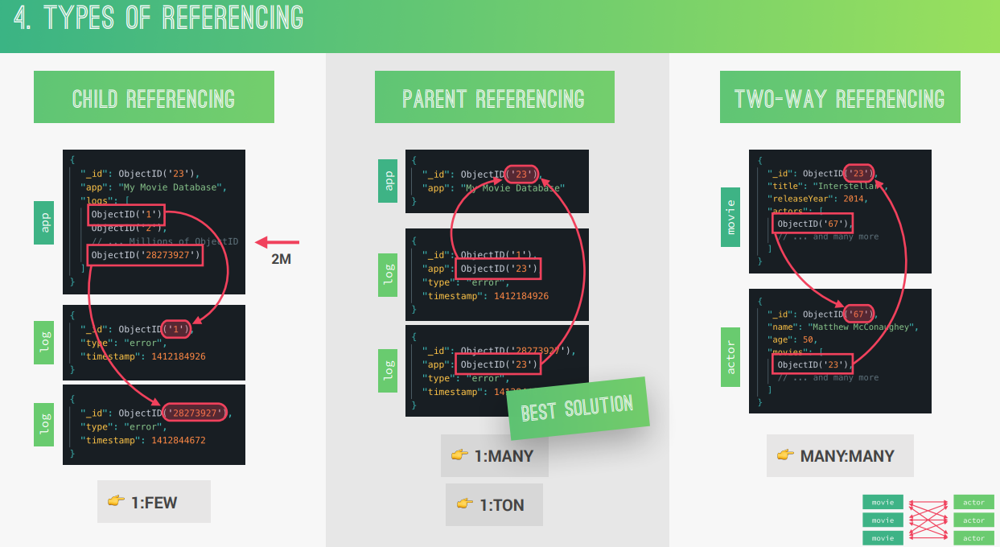
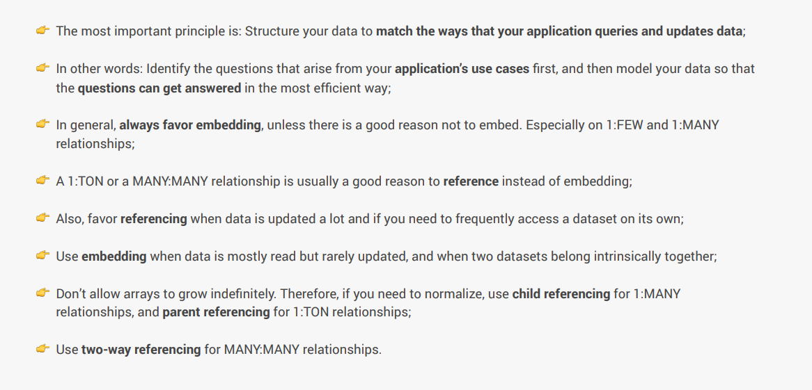

# Cour : **Modélisation des Données dans MongoDB :**


## 1. **Quand Utiliser l'Embedding et le Referencing :**
   
- **Définition** :
    
    - **Embedding** : Stocker des données directement dans un document. Par exemple, stocker les informations des acteurs directement dans un document de film.
    
    - **Referencing** : Stocker des références (comme des ObjectID) à d'autres documents. Par exemple, stocker uniquement l'ID d'un acteur dans un document de film et avoir une collection séparée pour les acteurs.

- **Critères de Décision** :

    - **Types de Relations** :
       
       - **1:FEW** : Un document est lié à quelques autres documents. Par exemple, un utilisateur a quelques adresses e-mail.
       
       - **1:MANY** : Un document est lié à plusieurs autres documents. Par exemple, un film a plusieurs critiques.
       
       - **1:TON** : Un document est lié à un très grand nombre d'autres documents. Par exemple, un utilisateur a des milliers de tweets.
       
       - **MANY:MANY** : Plusieurs documents sont liés à plusieurs autres documents. Par exemple, des étudiants et des cours.
    
    - **Modèles d'Accès aux Données** :

       - **Données principalement lues** : Si les données sont rarement mises à jour, l'embedding est souvent préférable.
    
       - **Données fréquemment mises à jour** : Si les données changent souvent, le referencing peut être plus efficace.
    
    - **Proximité des Données** :
       
       - **Données intrinsèquement liées** : Si les données sont souvent interrogées ensemble, l'embedding est recommandé.
       
       - **Données interrogées séparément** : Si les ensembles de données sont souvent interrogés indépendamment, le referencing est préférable.

- **Exemple** :
    
    - **Embedding** : Un document de film contient directement les informations sur les acteurs.
    
       ```json
       {
         "_id": ObjectId("123"),
         "title": "Inception",
         "actors": [
           {"name": "Leonardo DiCaprio", "role": "Cobb"},
           {"name": "Joseph Gordon-Levitt", "role": "Arthur"}
         ]
       }
       ```
    - **Referencing** : Un document de film contient des références à des documents d'acteurs.
    
       ```json
       {
         "_id": ObjectId("123"),
         "title": "Inception",
         "actor_ids": [ObjectId("456"), ObjectId("789")]
       }
       ```



## 2. **Types de Referencing**


- **Child Referencing** :
    
    - **Définition** : Le document parent contient une référence aux documents enfants.
    
    - **Utilisation** : Pour les relations 1:MANY.
    
    
    - **Exemple** :
       ```json
       {
         "_id": ObjectId("123"),
         "title": "Inception",
         "review_ids": [ObjectId("456"), ObjectId("789")]
       }
       ```


- **Parent Referencing** :

    - **Définition** : Le document enfant contient une référence au document parent.
    
    - **Utilisation** : Pour les relations 1:TON.
    
    - **Exemple** :

       ```json
       {
         "_id": ObjectId("456"),
         "review_text": "Great movie!",
         "movie_id": ObjectId("123")
       }
       ```

- **Two-Way Referencing** :
    
    - **Définition** : Les documents contiennent des références mutuelles.
    
    - **Utilisation** : Pour les relations MANY:MANY.
    
    - **Exemple** :
    
       ```json
       {
         "_id": ObjectId("123"),
         "title": "Inception",
         "actor_ids": [ObjectId("456"), ObjectId("789")]
       }
       {
         "_id": ObjectId("456"),
         "name": "Leonardo DiCaprio",
         "movie_ids": [ObjectId("123")]
       }
       ```




## 3. **Meilleures Pratiques**
   
- **Favoriser l'Embedding** :
    
    - **Définition** : Utiliser l'embedding lorsque les données sont souvent lues ensemble et rarement mises à jour.
    
    - **Exemple** : Stocker les informations des acteurs directement dans un document de film.

- **Éviter la Croissance Indéfinie des Tableaux** :
    
    - **Définition** : Ne pas permettre aux tableaux de devenir trop grands, car cela peut affecter les performances.
    
    - **Exemple** : Utiliser le referencing pour les relations 1:TON.
   
- **Utiliser le Referencing pour les Données Fréquemment Mises à Jour** :
    
    - **Définition** : Utiliser le referencing lorsque les données changent souvent ou doivent être accessibles indépendamment.
    
    - **Exemple** : Stocker les critiques de films dans une collection séparée.


