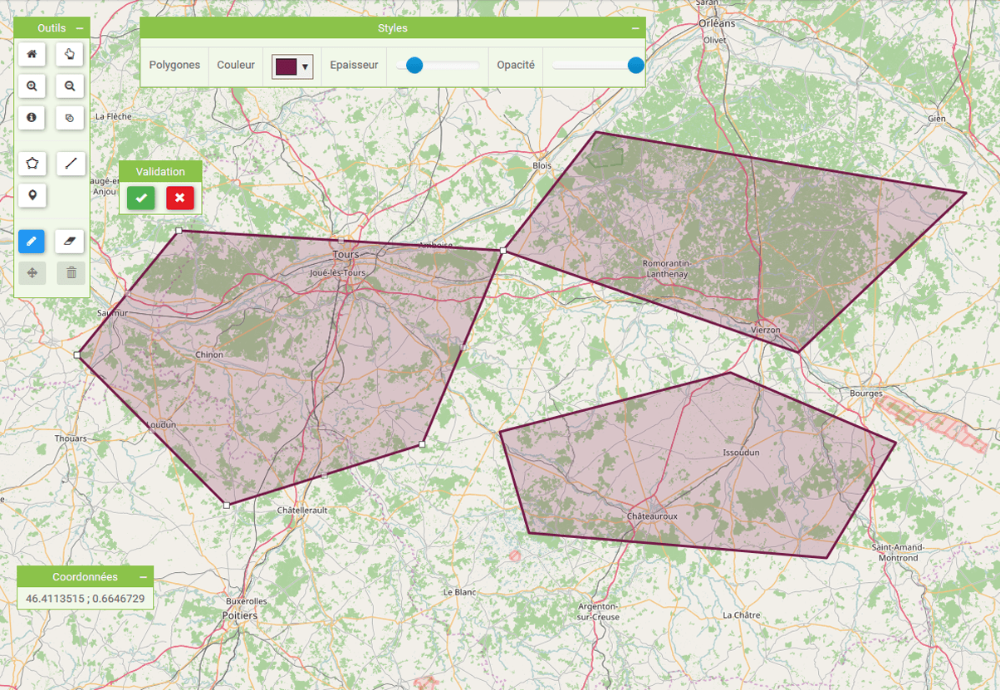

# Cour : **requêtes géospatiales :**


## 1. **Définition des requêtes géospatiales :**


- Les **requêtes géospatiales** permettent de rechercher et de manipuler des données basées sur leur position géographique. Dans MongoDB, elles sont particulièrement utiles pour :

    - **Localiser des documents** se trouvant dans une zone donnée (exemple : trouver tous les magasins dans un rayon de 5 km autour d'un point).
    - **Trier des résultats** par proximité d’un point.
    - **Effectuer des recherches complexes** combinant des données spatiales avec d'autres critères.

- Pour tirer parti des requêtes géospatiales, les documents doivent contenir des données de localisation et ces champs doivent être indexés avec un index géospatial (2dsphere ou 2d) :

```js

const mongoose = require('mongoose')
const slugify = require("slugify")
const validator = require('validator')
const User = require('./userModel')

// ============================= Schema ============================

const tourSchema = new mongoose.Schema(
    {
        name: {
            type: String,
            required: [true, 'A tour must have a name'],
            unique: true,
        },
        price: {
            type: Number,
            required: [true, 'A tour must have a price'],
        },
        startLocation: {
            // GeoJSON 
            type: {
                type: String,
                default: 'Point',
                enum: ["Point"]
            },
            coordinates: [Number],
            address: String,
            description: String
        },
    }

);

// ============================== indexes : ================================

// for  geoSpatial Query : 
tourSchema.index({
    startLocation: '2dsphere'
})


```


## 2. **Opérateur `$geoWithin`:**


- **Définition:**


    > L'opérateur `$geoWithin` permet de sélectionner les documents dont le champ géospatial se trouve **entièrement à l’intérieur** d’une zone géographique spécifiée. Cette zone peut être définie par :

    - Un polygone.
    - Un cercle (via `$center` ou `$centerSphere`).


- **Syntaxe:**

    La syntaxe générale pour une requête utilisant `$geoWithin` est :

    ```js
    db.collection.find({
    locationField: {
        $geoWithin: {
        $geometry: {
            type: "<GeoJSON Type>",
            coordinates: [ <coordinate array> ]
        }
        // Ou d'autres opérateurs comme $center ou $centerSphere
        }
    }
    })
    ```

    ```js
    // You must convert distance to unit radians : 

    const radius = unit === 'mi' ? distance / 3963.2 : distance / 6378.1;

    db.collection.find({
    locationField: {
        $geoWithin: {
            $centerSphere: [
                [lng, lat],
                radius
            ]
        }
    }
    });
    ```


- **Exemple avec `$geometry`:**

    Supposons que nous ayons une collection `places` avec des documents contenant un champ `location` (de type GeoJSON Point). Pour trouver les documents situés dans un polygone défini, nous pouvons écrire :

    ```js
    db.places.find({
    location: {
        $geoWithin: {
        $geometry: {
            type: "Polygon",
            coordinates: [
            [ [ -73.99756, 40.73083 ],
                [ -73.98756, 40.73083 ],
                [ -73.98756, 40.72083 ],
                [ -73.99756, 40.72083 ],
                [ -73.99756, 40.73083 ] ]
            ]
        }
        }
    }
    });
    ```

    

    > **Explications :**  
    > - **`$geometry`** définit la zone géographique recherchée.  
    > - **`type`** : Le type de géométrie (ici un "Polygon").  
    > - **`coordinates`** : Un tableau de coordonnées décrivant le polygone.  
    > - La requête retourne tous les documents dont le champ `location` se trouve entièrement dans ce polygone.


## 3. **Opérateur `$near`:**

- **Définition:**

    > L'opérateur `$near` permet de **trier les documents par proximité** à un point donné. Il est utile pour retrouver les documents les plus proches d'une position spécifique, en renvoyant les résultats dans l'ordre croissant de distance.


- **Syntaxe:**

    La syntaxe générale pour `$near` avec GeoJSON est :

    ```js
    db.collection.find({
    locationField: {
        $near: {
        $geometry: {
            type: "Point",
            coordinates: [ <longitude>, <latitude> ]
        },
        $maxDistance: <distanceInMeters>,  // facultatif
        $minDistance: <distanceInMeters>   // facultatif
        }
    }
    });
    ```

- **Exemple:**

    Pour trouver les lieux les plus proches d’un point, avec une distance maximale de 500 mètres, vous pouvez écrire :

    ```js
    db.places.find({
    location: {
        $near: {
        $geometry: {
            type: "Point",
            coordinates: [ -73.98756, 40.73083 ]
        },
        $maxDistance: 500  // en mètres
        }
    }
    });
    ```

    > **Explications :**  
    > - **`$geometry`** définit le point de référence pour la recherche.  
    > - **`$maxDistance`** (optionnel) spécifie la distance maximale (en mètres) pour la recherche.  
    > - **`$minDistance`** (optionnel) permet d'ignorer les documents trop proches du point si nécessaire.  
    > - Les documents sont renvoyés triés par distance croissante par rapport au point de référence.


### RQ :  **Points Importants**

- **Index Géospatial :**  
  Pour utiliser `$geoWithin` et `$near`, vous devez créer un index géospatial sur le champ de localisation. Par exemple :

  ```js
  db.places.createIndex({ location: "2dsphere" });
  // ou en JS :
  resSchema.index({nomDuChamp : "2dsphere"});
  ```

-  **Type de Données :**  
  MongoDB s'attend à des objets GeoJSON pour ces opérations (exemple : `{ type: "Point", coordinates: [longitude, latitude] }`).

- **Unités de Distance :**  
   Pour `$near` avec GeoJSON, les distances sont exprimées en **mètres**.

