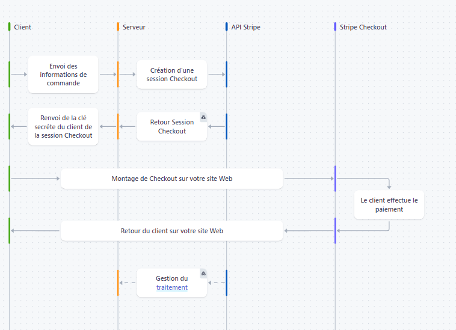
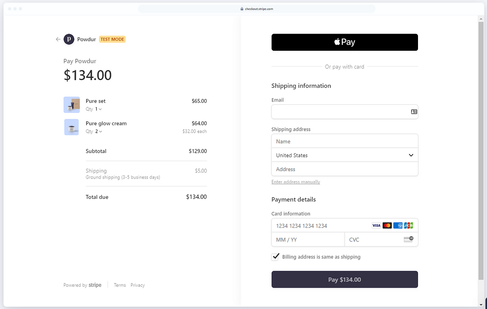

# Cour :  **Stripe Checkout - Intégration côté serveur avec Express.js**  


## 1. **Introduction:**

- **Def:**

    > Stripe Checkout est une **page de paiement préconçue** qui simplifie l’intégration des paiements. Elle prend en charge les **cartes bancaires, Apple Pay, Google Pay**, et gère automatiquement les erreurs et la sécurité.


- **Avantages**  

    1. **Simplicité d'intégration** : Pas besoin de concevoir une interface de paiement, Stripe fournit une page clé en main.  
    2. **Sécurité** : Conforme aux normes PCI-DSS, gère automatiquement la tokenisation et la prévention de la fraude.  
    3. **Expérience utilisateur optimisée** : Interface responsive, adaptée aux mobiles et optimisée pour maximiser les conversions.  
    4. **Support multi-devises et multi-paiements** : Accepte diverses devises et méthodes de paiement internationales.  
    5. **Gestion des abonnements et paiements récurrents** : Intégré avec Stripe Billing pour les modèles d’abonnement.  


- **Inconvénients**  

    1. **Moins de personnalisation** : Impossible de modifier complètement l’interface, contrairement à une intégration Stripe Elements.  
    2. **Dépendance à Stripe** : La page de paiement est hébergée par Stripe, ce qui limite le contrôle sur l'expérience utilisateur.  
    3. **Frais de transaction** : Stripe prend une commission sur chaque paiement, ce qui peut être un inconvénient pour les marges faibles.  
    4. **Restrictions géographiques** : Tous les modes de paiement ne sont pas disponibles dans tous les pays.  


## 2. **Fonctionnement de `Stripe Checkout`:**

- **Étape 1 : Envoi des informations de commande (Frontend → Backend)**

    - Le **client** ajoute des articles à son panier et initie le paiement.
    - Le **frontend** envoie les informations de commande (produits, quantités, prix, etc.) au **serveur backend**.


- **Étape 2 : Création d’une session Checkout (Backend → API Stripe)**

    - Le **serveur backend** reçoit la commande et crée une **session Checkout** en appelant l’API de **Stripe**.

    - Il envoie des informations comme :
        - Montant total
        - Devise
        - URL de retour après paiement
        - Description de la commande


- **Étape 3 : Retour de la session Checkout (API Stripe → Backend)**

    - Stripe retourne une **session Checkout** contenant une clé secrète et une URL unique permettant d’accéder à l’interface de paiement.


- **Étape 4 : Envoi de la clé secrète au client (Backend → Frontend)**

    - Le **serveur backend** renvoie la clé secrète de la session Checkout au **frontend**.
    - Cette clé est nécessaire pour intégrer Stripe Checkout sur le site web.


- **Étape 5 : Montage de Checkout sur le site web (Frontend)**

    - Le **frontend** utilise la clé secrète pour **afficher l'interface de paiement Stripe Checkout**.
    - L’utilisateur est redirigé vers **Stripe Checkout** où il peut entrer ses informations de paiement.


- **Étape 6 : Le client effectue le paiement (Stripe Checkout)**

    - L’utilisateur saisit ses informations bancaires et valide le paiement.
    - Stripe traite la transaction et confirme le paiement.


- **Étape 7 : Retour du client sur le site web (Stripe Checkout → Frontend)**

    - Après paiement, **Stripe redirige le client vers une page de confirmation sur votre site** (URL fournie lors de la création de la session Checkout).


- **Étape 8 : Gestion du traitement post-paiement (Backend)**

    - Le **serveur backend** vérifie le paiement (via webhook Stripe si nécessaire).
    - Il met à jour la base de données pour **valider la commande**.
    - Il peut déclencher des actions comme l’envoi d’un email de confirmation ou l’activation d’un abonnement.





## 3. **Implémentation:**

- **frontend en ``React JS`` : `Frontend → Backend`**


    ```javascript
    // npm install @stripe/stripe-js
    import { loadStripe } from '@stripe/stripe-js';

    const stripePromise = loadStripe('pk_test_xxx'); // Clé publique

    const checkout = async (id) => {

        // stripe pour la réderiction vers la page de checkout : 
        const stripe = await stripePromise;

        
        // GET /create-checkout-session pour url de stripe : 
        const response = await fetch(`http://127.0.0.1:3000/create-checkout-session/${id}`, {
            method: 'GET',
            headers: { 'Content-Type': 'application/json' },
        });
        const session = await response.json();
    
        // redriction vers la page de stripe : 
        await stripe.redirectToCheckout({ sessionId: session.id });
    };

    // view for button : 
    // Appelle checkout() quand l’utilisateur clique sur "Payer"
    <button onClick={checkout}>Acheter</button>
    ```


- **backend en `express JS` : `Backend → API Stripe` && `API Stripe → Backend`**


    ```javascript
    require('dotenv').config();
    const express = require('express');
    const stripe = require('stripe')(process.env.STRIPE_SECRET_KEY);
    const cors = require('cors');

    const app = express();
    app.use(express.json());
    app.use(cors());

    // 🎯 Route pour créer une session de paiement Stripe Checkout
    app.post('/create-checkout-session/:id' , authController.protect , async (req, res) => {
        try {

            // 1) Get the currently booked ressource : 

            const ressource = await ModelName.findById(req.params.id);

            if (!ressource) {
                return next(new AppError('No ressource found', 400));
            }

            // 2) Create checkout session  :

            // si la payement marche bien : stripe fait GET sur /successUrl
            const successUrl = `${req.protocol}://${req.get('host')}/?tour=${req.params.tourId}&user=${req.user._id}&price=${tour.price}`;
            
            const session = await stripe.checkout.sessions.create({
                payment_method_types: ['card'],
                success_url:successUrl,
                cancel_url: `${req.protocol}://${req.get('host')}/ressource/${ressource.slug}`,
                customer_email: req.user.email,  // Tu peux aussi utiliser `customer` si tu as un ID Stripe
                client_reference_id: req.params.id,
                mode: 'payment',  // Obligatoire maintenant
                line_items: [
                    {
                        price_data: {
                            currency: 'usd',
                            unit_amount: ressource.price * 100,  // Stripe attend un montant en centimes
                            product_data: {
                                name: `${ressource.name} Tour`,
                                description: ressource.summary,
                                images: [`https://natours.dev/img/tours/${ressource.imageCover}`]
                            }
                        },
                        quantity: 1
                    }
                ]

            });
        
            // 3) send  session : 
            res.status(200).json({
                status: 'success',
                session
            })
        
        } catch (error) {
            res.status(500).json({ error: error.message });
        }
    });

    ```


- **Page de stripe :`Backend → Frontend` && `Frontend : Montage de Checkout`**

    


- **post-paiement : ``Stripe GET /success_url -> Backend``**

    ```js
    // dans viewRouter : 
    router.get(
        '/',
        bookingController.createBookingCheckout,
        authController.isLoggedIn,
        viewsController.getOverview
    );

    // dans BookingController : 
    const createBookingCheckout = catchAsync(async (req, res, next) => {

        // this is only for dev mode : is not secure : evryone can make booking without paying :

        const { tour, user, price } = req.query;

        if (!tour || !user || !price) return next();

        await Booking.create({
            tour: tour,
            user: user,
            price: price
        });

        const homeUrl = req.originalUrl.split('?')[0];
        res.redirect(homeUrl);
    });
    ```


